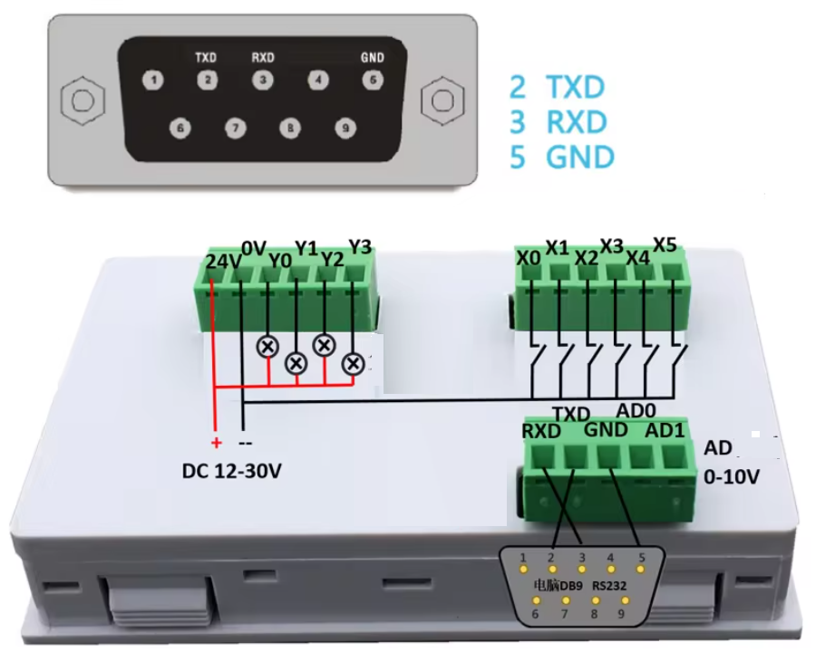

# STM32 PLC FX-10MT
Programación de un plc FX-10MT basado en el microcontrolador STM32F051C8T6 desde el entorno STM32CubeIDE.





## Identificacion de los pines I/0

### Programacion
```
Conexiones estándar entre el ST-LINK y el STM32F051C8T6:
ST-LINK Pin 1 (VCC) → Pin VDD del microcontrolador (3.3V).
ST-LINK Pin 2 (SWDIO) → Pin SWDIO (PA13) J2 del microcontrolador .
ST-LINK Pin 3 (GND) → Pin GND del microcontrolador.
ST-LINK Pin 4 (SWCLK) → Pin SWCLK (PA14) J4 del microcontrolador.
```
### Comunicacion serial
```
PA2 (USART2_TX): Este pin se utiliza para la transmisión de datos.
PA3 (USART2_RX): Este pin se utiliza para la recepción de datos.
```
### Entradas digitales 
```
X0 → PA0
X1 → PB3
X2 → PB4
X3 → PA10
X4 → PA9
X5 → PA8
```
### Entradas analogas 0-10v
```
AD0  → PA5
AD1  → PA7
```
### Salidas digitales 
```
Y0 → PA4
Y1 → PA7
Y2 → PB15
Y3 → PB14
```
### Pulsadores en la pantalla 
```
↑/SET  → PB9
↓      → PB8
+      → PB7
-      → PB6
```
### Control display 7 segmentos
```
El TM1640 es un controlador de visualización LED de 16 segmentos que se utiliza
comúnmente para controlar pantallas LED matriciales o segmentos de 7 segmentos.
↑/SET  → PB9
↓      → PB8
+      → PB7
-      → PB6
```


El TM1640 es un controlador de visualización LED de 16 segmentos que se utiliza comúnmente para controlar pantallas LED matriciales o segmentos de 7 segmentos
